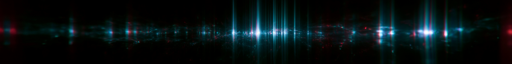

# AETHER CURRENTS



**▸ [LIVE — full experience](https://sinaida-space.github.io/aether-currents/)**

Conduct sound with your hands. A browser-based instrument: on-device hand
tracking drives granular audio synthesis and a real-time visual layer.
Static site, no build step, no framework — vanilla JS/CSS with ES modules.

Developed by Sinaida, a new media artist currently based in Prague, working
in interactive projection, TouchDesigner, GLSL and generative AI. Telefm
(Belgrade) contributed the granular synthesis design and hands-on usage
feedback that shaped the instrument's gesture language.

## Artists

- **Sinaida** — new media artist, Prague — [sinaida.eu](https://sinaida.eu) — concept, design, engineering
- **Telefm** (Belgrade) — [telefm.bandcamp.com](https://telefm.bandcamp.com/) — granular synth design, usage feedback

## Quality tiers

Aether Currents auto-detects device capability on load (`syscheck.js`) and
applies the best-fitting tier, with a sticky user-override if you switch
manually:

```
FULL ....... full-resolution field sim, 60Hz tracking
BALANCED ... 192-particle sim, 45Hz / 640px tracking
LIGHT ...... minimal sim, lowest tracking load
```

A perf watchdog steps down one tier at a time (never straight to LIGHT) if
frame time degrades, keeping hand-following latency as tight as possible on
the current device.

## Scriabin color mapping

Each of the 12 chromatic notes played tints the visual field with its
canonical Scriabin synesthesia color — Alexander Scriabin's own
note-to-color correspondences, rather than an arbitrary palette:

```
C  ...... red        F  ...... deep red
C# ...... violet      F# ...... bright azure
D  ...... yellow      G  ...... orange
D# ...... steel glint G# ...... purple-violet
E  ...... pearly moonlit A  ... green
                       A# ...... rosy steel
                       B  ...... pearly blue
```

The active note's color is derived from root + scale position each frame
and smoothed over ~100ms so octave and band changes glide rather than flash;
spectral centroid and level modulate brightness/saturation around that hue.

## Gestures

```
RIGHT HAND x/y ... playhead position / pitch
RIGHT PINCH ...... grain size
LEFT HAND HEIGHT . grain density
TWO-HAND DISTANCE  filter + space
FIST ............. freeze the cloud
FAST OPEN PALM ... burst
```

## MIDI out

Gesture and beat events stream live as MIDI CC/notes to any Web MIDI output
port — `▸ MIDI` in the control row, or the `M` key. Turns the instrument into
a live controller for Ableton, TouchDesigner, or hardware. See
[docs/midi.md](docs/midi.md) for the full CC table and DAW setup.

## Running locally

```
python3 -m http.server 8123
```

Open `http://localhost:8123`. No build, no dependencies to install.

## Structure

```
index.html            app shell
css/main.css           all styles
js/main.js              boot module: consent, system check, mode select, camera
js/syscheck.js          capability probe (FULL vs LIGHT mode)
legal/                  privacy, terms, license
```

## Privacy

No cookies, no analytics, no server. Camera is processed entirely on-device.
See [legal/privacy.html](legal/privacy.html).

## License

Code: MIT. Output licensing (recordings you make with the tool) is covered
separately — see [legal/license.html](legal/license.html).

Made by Sinaida — [sinaida.eu](https://sinaida.eu)
